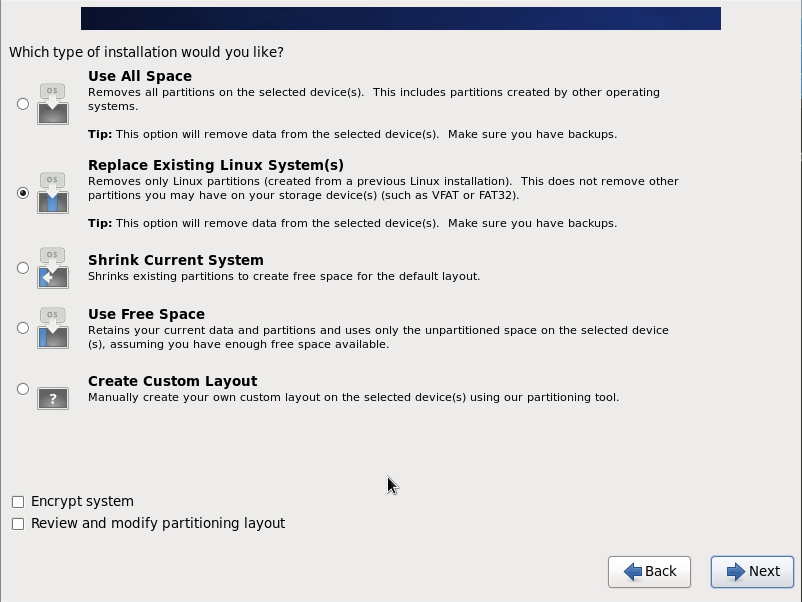

# CentOS 6 Install

__Disc Media Test__  

[ Skip ]  

__CentOS 6 Main Logo__ 

[ Next ]  

__Select Language to use during the installation process__  

[ English (English) ] > [ Next ]

__Keyboard Layout__  

[ U.S. English ] > [ Next ]

__Select type of devices__  

[ Basic Storage Devices ] > [ Next ]

__Storage Device Warning__  

[ Yes, discard any data ]

__Change the hostname__   

// custom hostname

__Configure Network__   

// check Network Connections

__Select Timezone__   

__Mouse over Asia Timezone in map__   

__Set Asia Timezone__  

[ Next ]

__Set Root Password__   
 
// Input both Root Password and Confirm Password

__Password Input Warning 1__   
 
 // Then passwords not set

__Password Input Warning 2__   
 
 // Then weak password set

__Select type of installation__   
 
 // Default : Replace Existing Linux System(s)

__Change type of installation__   
 
 // My choice : Use All Space > [ Next ]

__Confirm Writing storage configuration to disk__   
 
 [ Write changes to disk ]

__Installing__   
 

__Installation is complete__   
 
[ Reboot ]

__OS Rebooting__   
 

__Login Message__   
 

### CentOS 6 Install Complete!!!
