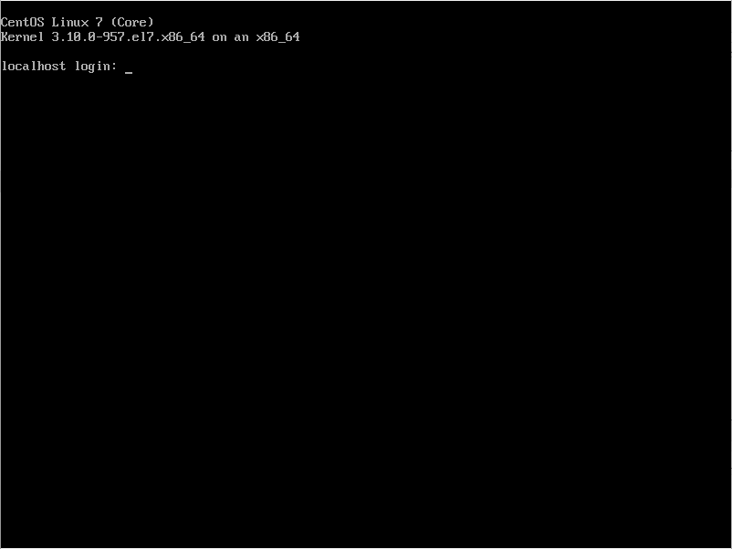

# CentOS 7 Install

__Select Language to use during the installation process__  

[ English (English) ] [ U.S. English ] > [ Continue ]

__Installation Summary__  

[ DATE & TIME ] click

__Select Timezone__   

__Mouse over Asia Timezone in map__   

Map click > [ Done ]

__Set Asia Timezone__  

// Check Timezone  
[ INSTALLATION DESTINATION ] click

__Device Seletion__   

// Check Device Setting  
[ Done ]

__Set Device__   

// Check Device  
[ NETWORK & HOSTNAME ] click

__Check Network and Hostname__   

// Check Network and Hostname Setting

[ off ] click &nbsp;&nbsp;&nbsp;&nbsp;&nbsp; // for Ethernet Network ON  

__Check Ethernet Network ON__

// Check Ethernet Network ON  
[ Done ]

__Set NETWORK and HOSTNAME__   
 
 // Check NETWORK and HOSTNAME  
[ Begin Installation ] 

__USER SETTING__   
 
< with OS Installing... >  
 [ ROOT PASSWORD ] click

__Root Password__   
 
< with OS Installing... >  
// Input both Root Password and Confirm Password

__Set Root Password__   
 
 < with OS Installing... >  
[ Done ]

__Check USER SETTING__   
 
 < with OS Installing... >  
 // Check USER SETTING

__Installation is complete__   
 
[ Reboot ]

__Login Message__   
 

### CentOS 7 Install Complete!!!
