# OpenJDK

## OpenJDK Package Downloads 
- java.net : https://jdk.java.net/archive/  

- github : https://github.com/ojdkbuild/ojdkbuild  


> java.net
> 
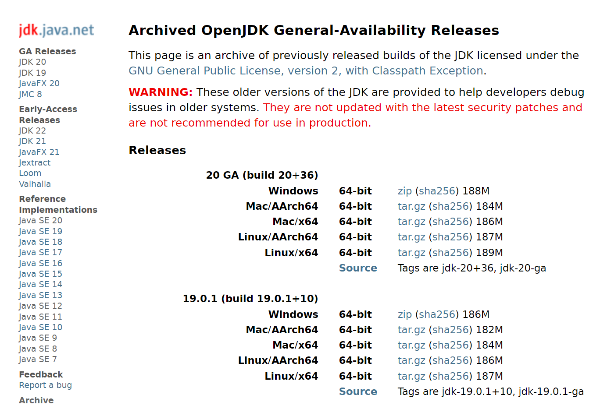
<p></p>

> github
> 
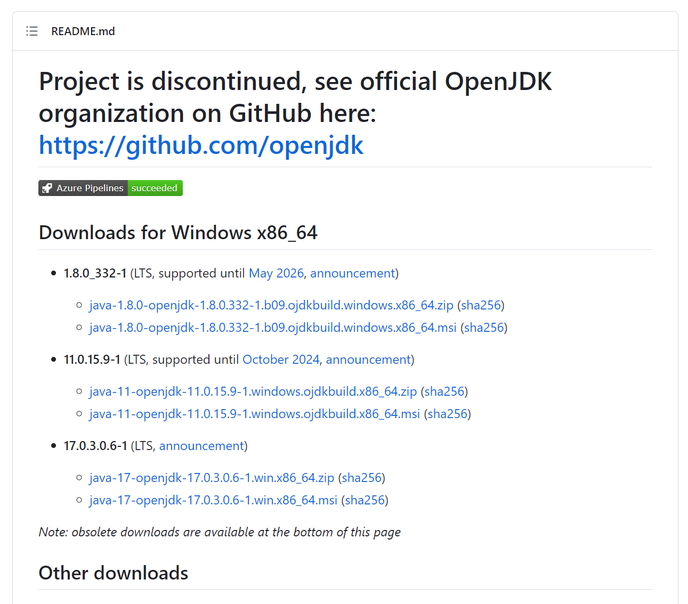
<p></p>

__Downloads .zip file__  

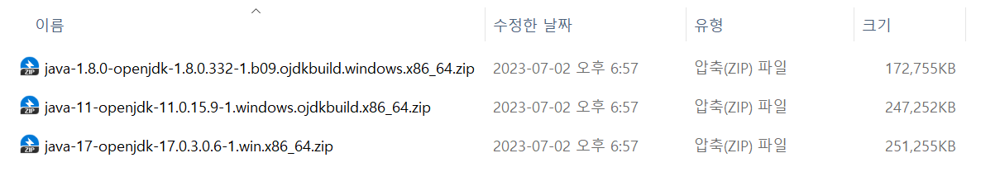
<p></p>

## Set OpenJDK Package

__Unzip__  

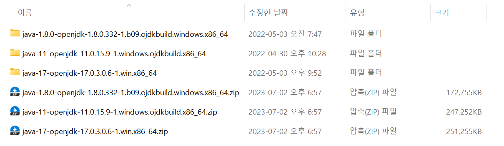
<p></p>

__Rename Folders__  


<p></p>

## Environment Variables Edit

__System Properties__   

Ctrl + R  
```
sysdm.cpl ,3
```
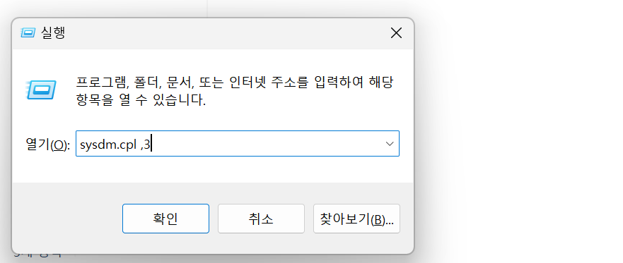
<p></p>

__Advenced → Environment Variables__   

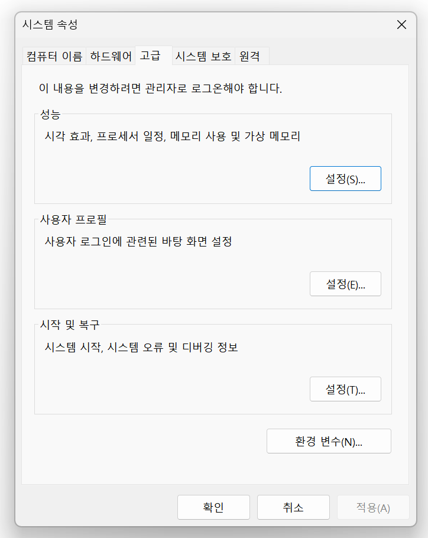
<p></p>

__Environment Variables__   

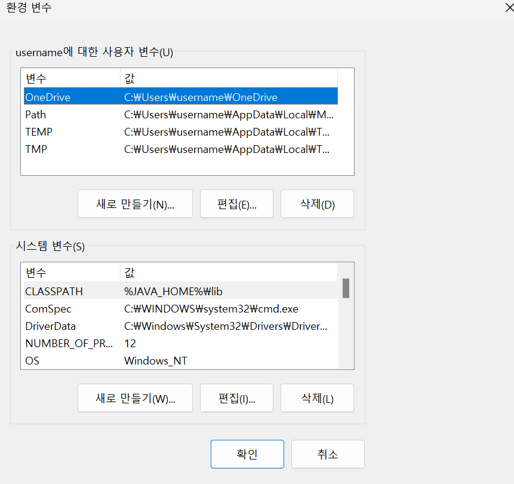
<p></p>

__System Variables Edit__   

```
Variable Name : JAVA_HOME
Variable Value : [JDK Install PAth]
```
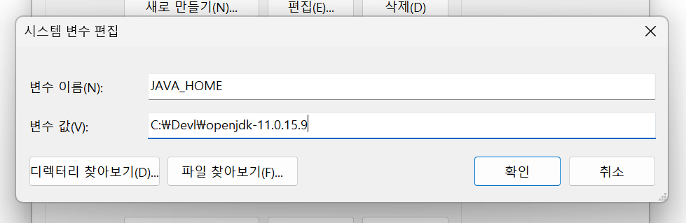
<p></p>

__Add System Variables__   

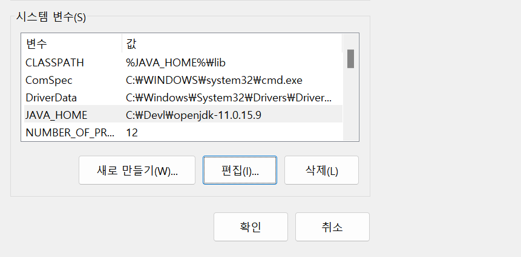
<p></p>

__User Variables Path Edit__   
 
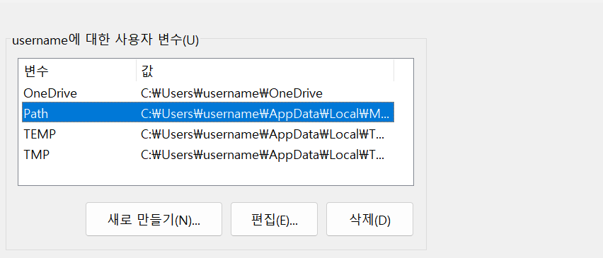
<p></p>

__Environment Variables Edit__   
 
[New] Click

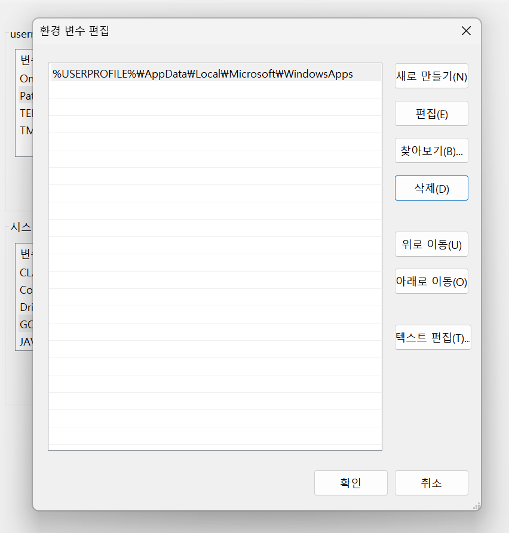
<p></p>

__Add Environment Variables__   
 
```
%JAVA_HOME%\bin
```
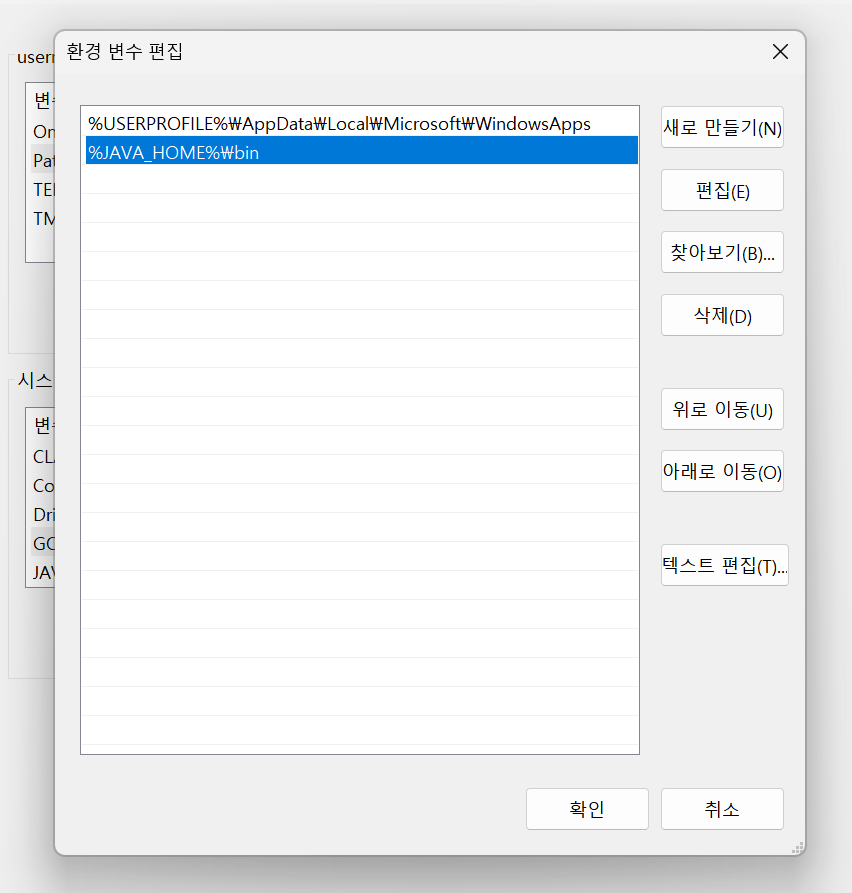
<p></p>

__Edit Result__   
 
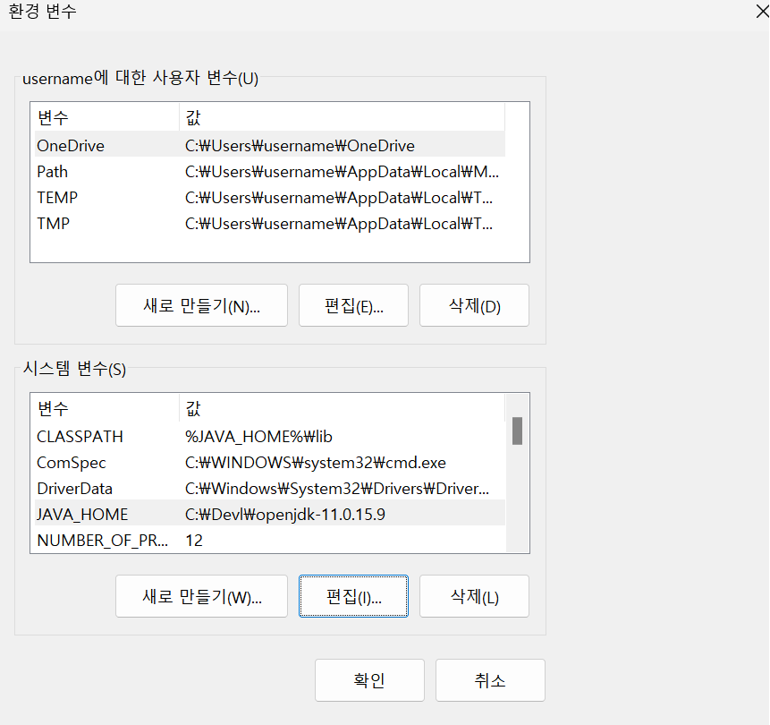
<p></p>

