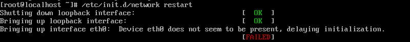
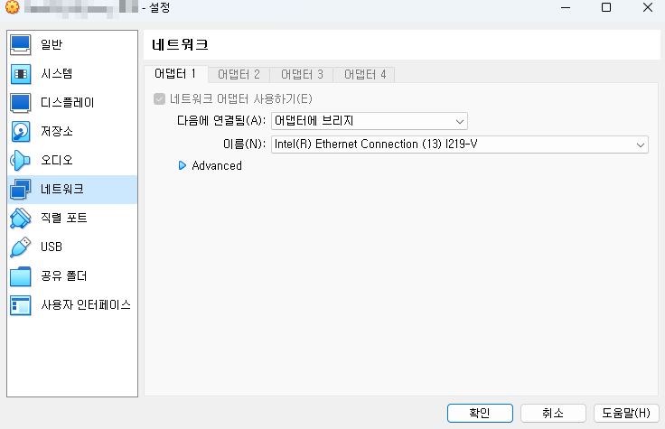
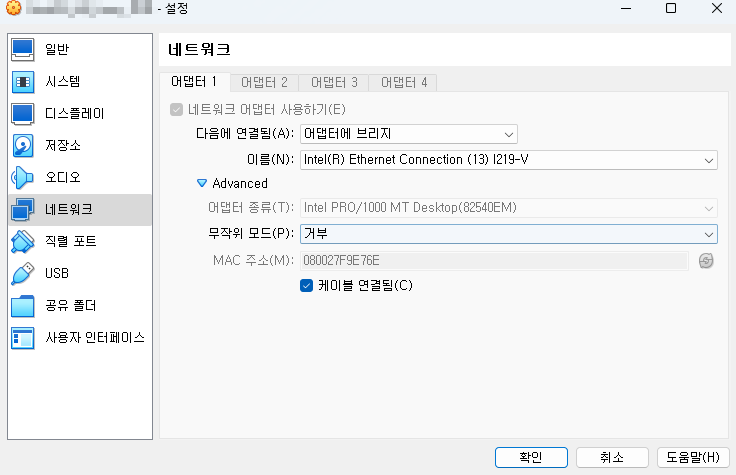
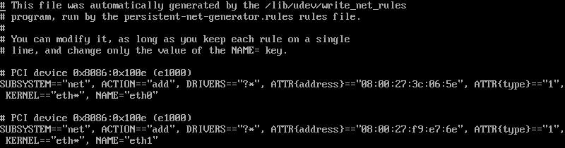
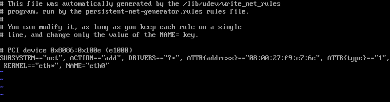
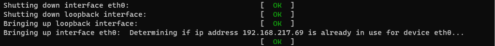

# VM(Virtual Machine) ERROR 01
## Linux MAC 충돌 해소
### 네트워크 설정
```sh
vi /etc/sysconfig/network-script/ifcfg-eth0
```
__BEFORE__
```ini
DEVICE=eth0
HWADDR=08:00:27:3C:06:5E
TYPE=Ethernet
UUID=00000000-0000-0000-0000-000000000000
ONBOOT=no
NM_CONTROLLED=yes
BOOTPROTO=dhcp
```
__AFTER__
```ini
DEVICE=eth0
HWADDR=08:00:27:3C:06:5E
TYPE=Ethernet
UUID=00000000-0000-0000-0000-000000000000
ONBOOT=yes
NM_CONTROLLED=no
BOOTPROTO=static
IPADDR=192.168.100.100
NETMASK=255.255.128.0
GATEWAY=192.168.128.1
DNS1=8.8.8.8
IPV6INIT=no
USERRCTL=no
```
```sh
/etc/init.d/network restart
```
__ERROR MESSAGE__  
Bringing up interface eth0: Device eth0 does not seem to be present, delaying initialization [FAILED]



### 조치방법 
- Virtual Machine 에서 설정되어 있는 MAC 주소 확인  




- 리눅스에 등록되어 있는 MAC 주소를 Virtual Machine MAC 주소 설정만 남기고 삭제 및 수정  

```sh
vi /etc/udev/rules.d/70-persistent-net.rules
```




- 네트워크 설정의 MAC 주소 변경 적용
```sh
vi /etc/sysconfig/network-script/ifcfg-eth0
```
```ini
DEVICE=eth0
HWADDR=08:00:27:F9:E7:6E
TYPE=Ethernet
UUID=00000000-0000-0000-0000-000000000000
ONBOOT=yes
NM_CONTROLLED=no
BOOTPROTO=static
IPADDR=192.168.100.100
NETMASK=255.255.128.0
GATEWAY=192.168.128.1
DNS1=8.8.8.8
IPV6INIT=no
USERRCTL=no
```
```sh
/etc/init.d/network restart
```
